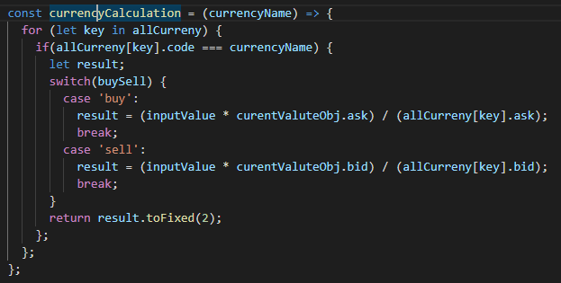

# Poland Currency Converter :moneybag:
Shows current exchange rates from the National **Bank of Poland**:bank:.


***[NBP Web API HERE :muscle:](http://api.nbp.pl/):bank:***

:euro: You can convert currency both by buying and selling currency :yen:.

:computer: Unfortunately, github cannot send requests to unsecured :unlock:http servers, so it is not possible to view the service on the github page. :cry:

***

:vulcan_salute: I used to get data from the server of the National Bank of Poland through a fetch request and get data in jeson format.


***

:writing_hand: I used a very simple formula for currency conversion. It is clear that on many other currency APIs, you can immediately get data with a currency crosscourt, but these services are not accessible to me. they are paid :dollar:.



***

:bulb: To start the series, you need to install all the :hammer_and_wrench: dependencies.

## what you needs to be done to start the project?

* **download repository**


* **instal all dependencies**

```
npm instal
```

* **Run build**

```
npm run build
```

* **Run Dev server**

```
npm start
```
